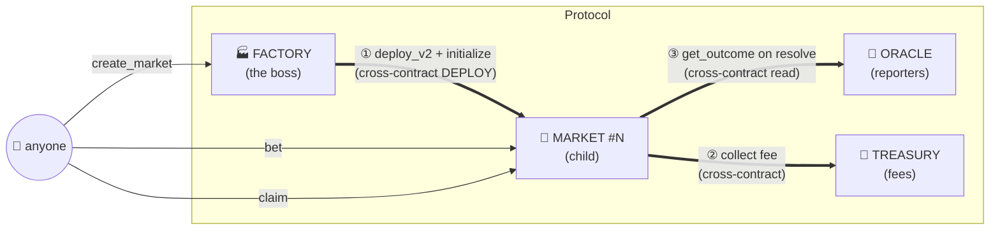

# 🎰 PITBOSS

**Every market answers to the boss.**

A permissionless, on-chain **pari-mutuel prediction-market _protocol_** on Stellar (Soroban). Anyone can spin up a market from a **Factory**; every market shares one resolution **Oracle** and routes protocol fees to a common **Treasury** — a real, canonical **cross-contract mesh** across four contracts.

> Belt-series capstone: **primitive → product → protocol.**
> White (gift links) → Yellow ([one market](https://github.com/Hijanhv)) → **Level 3: the whole protocol.**

<p align="center">
  <a href="#-live-on-testnet"></a>
  
  
  
</p>

---

## The inter-contract mesh

Cross-contract calls run in **three directions** — this is the headline of a Level-3 build.



| Direction | Call | Proven by test |
|---|---|---|
| Factory → Market | `deploy_v2` from installed Wasm hash, then `initialize` | `factory::deploy::factory_deploys_initializes_and_child_runs_full_cycle` |
| Market → Treasury | `collect` protocol fee on every bet | `market::bet_routes_fee_to_treasury_and_updates_pools` |
| Market → Oracle | `get_outcome` when resolving | `market::winner_claims_entire_pot` |

---

## Live on testnet

| Contract | Address |
|---|---|
| 🏭 **Factory** | [`CBOOJITGRKEOWRWYEZ2NTB3LWWC4ZI6YQXPW6M6DGYYXDAUNH3RPOGNB`](https://stellar.expert/explorer/testnet/contract/CBOOJITGRKEOWRWYEZ2NTB3LWWC4ZI6YQXPW6M6DGYYXDAUNH3RPOGNB) |
| 🔮 **Oracle** | [`CA57YKYJSNQTAKOXFJSC7ESJTI5MFOASIELGDAKCGTWVVURYTQUZW5OH`](https://stellar.expert/explorer/testnet/contract/CA57YKYJSNQTAKOXFJSC7ESJTI5MFOASIELGDAKCGTWVVURYTQUZW5OH) |
| 🏦 **Treasury** | [`CB5KCQR7IWXDMJ7ON4BVBWJNFIYR5TSXFUKGUXBDMR4H2DJKK3BEG37L`](https://stellar.expert/explorer/testnet/contract/CB5KCQR7IWXDMJ7ON4BVBWJNFIYR5TSXFUKGUXBDMR4H2DJKK3BEG37L) |
| 🎲 Sample market | [`CBYMLX7OTJ3XB3FEMXUVCRM2YO3BXQ3CGW2LVNAOQFCDAI25NXT74ECE`](https://stellar.expert/explorer/testnet/contract/CBYMLX7OTJ3XB3FEMXUVCRM2YO3BXQ3CGW2LVNAOQFCDAI25NXT74ECE) |

**Verifiable interactions:**
- Market created (Factory → Market deploy): [`0b515a04…907b8f`](https://stellar.expert/explorer/testnet/tx/0b515a04f17c3f633d0900091fdf0c52bc871ad49a492d3f1f2a6c743c907b8f)
- Sample bet (Market → Treasury fee routing): [`b7de416a…8bf8fa1`](https://stellar.expert/explorer/testnet/tx/b7de416af070e69336b17ff7d2873696df34ba0ffd524b6ffde8d1b4c8bf8fa1)

🔗 **Live app:** **https://pitboss-theta.vercel.app**

---

## How it works

A single **pari-mutuel** pool: everyone who backs the winning side splits the **entire pot** pro-rata by stake.

```
payout = winning_stake × (pool_yes + pool_no) / winning_pool
```

1. **Create** — `factory.create_market(question, close_ledger)` deploys a fresh Market child from the installed Wasm hash and initializes it with the shared oracle/treasury/token.
2. **Bet** — `market.bet(side, amount)` takes a `fee_bps` cut → **Treasury** (cross-contract), and adds the net stake to the YES/NO pool.
3. **Report** — an authorized reporter publishes the binary outcome to the **Oracle**.
4. **Resolve** — after `close_ledger`, anyone calls `market.resolve()`, which **reads the Oracle** cross-contract and locks the outcome.
5. **Claim** — winners call `market.claim()` for their pro-rata share.

---

## Monorepo layout

```
pitboss/
├── contracts/            Rust / Soroban (soroban-sdk 26)
│   ├── oracle/           reporter-gated resolution        (5 tests)
│   ├── treasury/         protocol fee sink                (4 tests)
│   ├── market/           pari-mutuel bet/resolve/claim    (8 tests)
│   └── factory/          deploys + registers markets      (3 + 1 tests)
├── packages/bindings/    generated @pitboss/* TS clients
├── apps/web/             Next.js 14 · Tailwind · stellar-wallets-kit
├── scripts/deploy.sh     one-shot testnet deployment
└── deployments/testnet.json
```

## Requirement → feature map

| Level-3 requirement | How PITBOSS satisfies it |
|---|---|
| Advanced contracts | Factory deploys children from an installed Wasm hash; pari-mutuel payout math |
| Inter-contract communication | Factory→Market, Market→Oracle, Market→Treasury |
| Event streaming / real-time | RPC `getEvents` polled across all contracts → live tape + odds |
| CI/CD | GitHub Actions: `cargo test` + wasm deploy test, `pnpm lint/test/build` |
| Deployment workflow | `scripts/deploy.sh`: install → deploy → wire → create → bet |
| Mobile responsive | Tailwind, mobile-first |
| Error handling + loading | Error boundary, skeletons, typed contract errors → toasts, tx lifecycle |
| Contract + frontend tests | 21 Rust tests + 12 Vitest/RTL tests |
| Production architecture | pnpm+turbo monorepo, generated bindings, zod env, RPC clients |
| Docs + demo | This README + mermaid diagram + addresses + demo script |

---

## Quick start

```bash
# prerequisites: Rust + wasm32v1-none, stellar-cli 27, Node 20+, pnpm
pnpm install

# contracts
make test          # 20 fast tests (Oracle, Treasury, Market, Factory)
make test-all      # + builds wasm and runs the Factory→Market deploy test (21)

# deploy your own instance to testnet
DEPLOYER=<funded-identity> ./scripts/deploy.sh   # writes deployments/testnet.json + apps/web/.env.local

# generate fresh bindings (optional)
stellar contract bindings typescript --wasm target/wasm32v1-none/release/factory.wasm \
  --output-dir packages/bindings/factory --overwrite

# web
pnpm --filter @pitboss/web dev     # http://localhost:3000
pnpm --filter @pitboss/web test    # 12 tests
pnpm --filter @pitboss/web build
```

The frontend ships with the live testnet addresses as **zod-validated defaults**, so it runs with zero config. Override any `NEXT_PUBLIC_*` in `apps/web/.env.local` (see `.env.example`).

---

## Tests

```
Contracts (cargo test-all)          21 passing
  oracle    5   treasury  4   market  8   factory 3 (+1 gated deploy test)
Web (vitest)                        12 passing
  odds/payout math · formatting · ToteBoard render
```

All three cross-contract directions are exercised by real tests — the Market suite wires the actual Oracle + Treasury contracts in-env; the Factory suite `contractimport!`s the built `market.wasm` and drives a full deploy → bet → report → resolve → claim cycle.

---

## Demo (1–2 min)

1. Connect a wallet → **Create** a market (Factory deploys a child live).
2. Two wallets bet opposite sides → the tote board **steams** as odds move; the **live tape** streams every event.
3. A reporter publishes the outcome to the **Oracle**; anyone **resolves** the market (Market reads the Oracle).
4. The winner **claims** their pro-rata share. Every step links to Stellar Expert.

---

## Stack

Rust / soroban-sdk 26 · Stellar CLI 27 · Next.js 14 (App Router) · TypeScript · Tailwind · `@creit.tech/stellar-wallets-kit` · TanStack Query · zod · Vitest · pnpm + Turborepo · GitHub Actions · Vercel.
